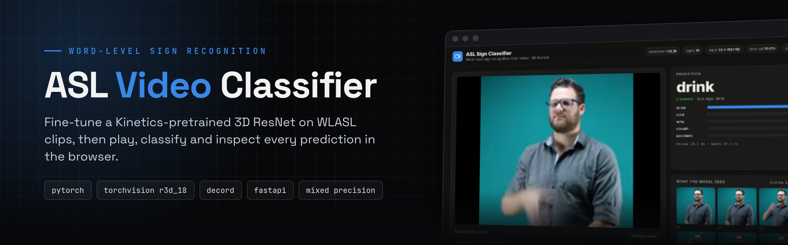
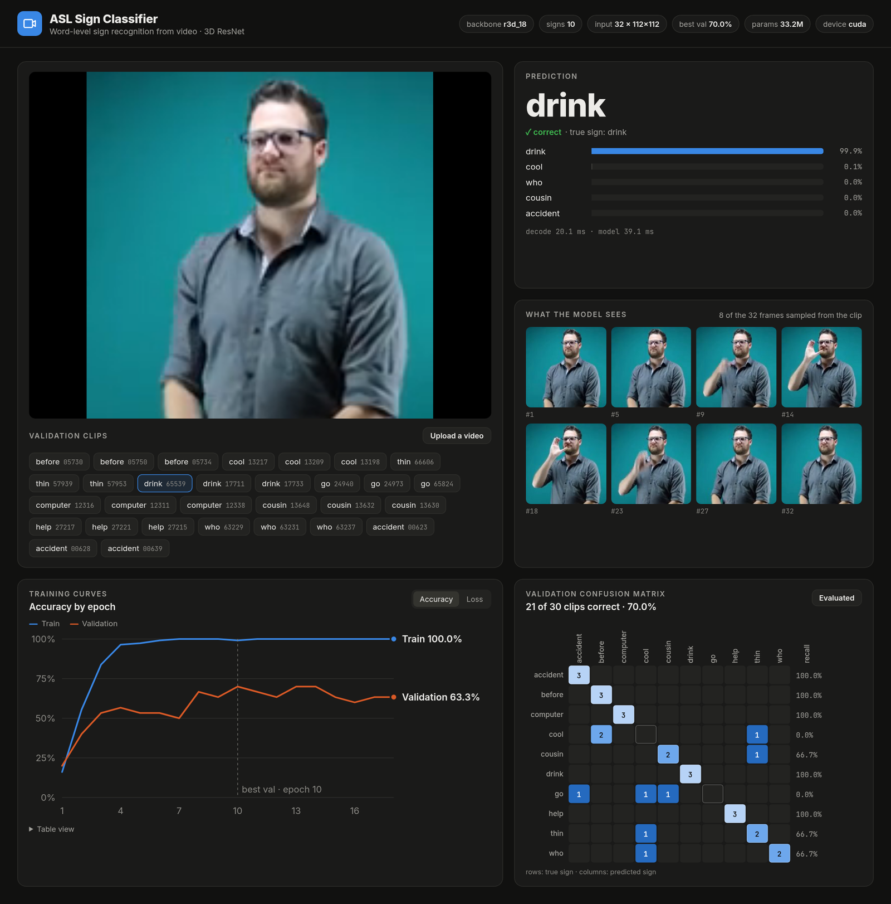
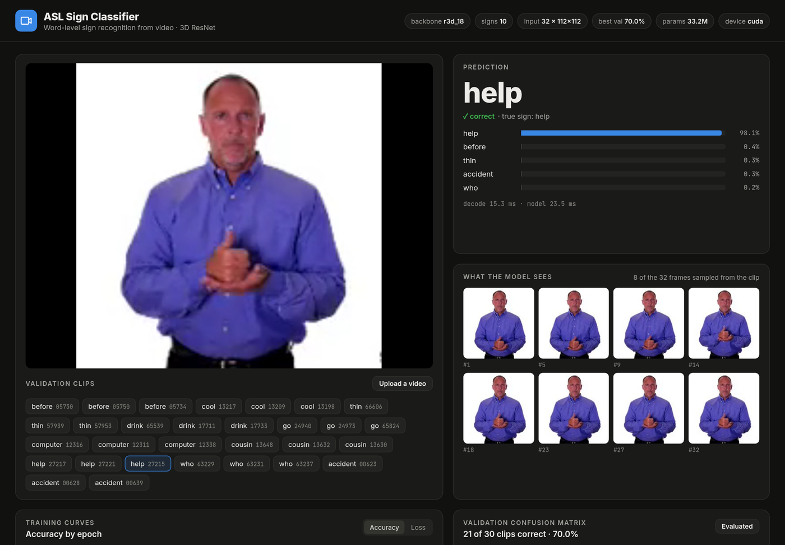
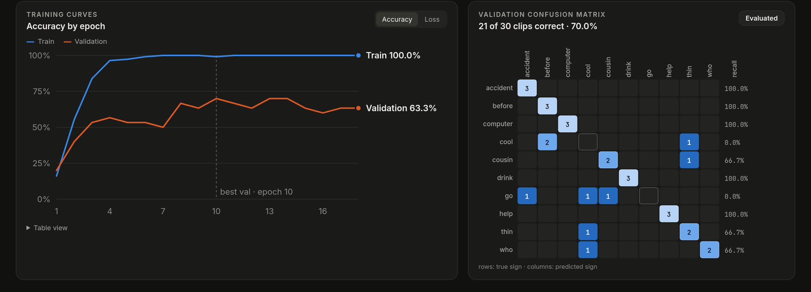

<div align="center">



<br>

[](requirements.txt)
[D--18-151c2b?style=flat-square)](model.py)
[](#quick-start)
[](app.py)

**Word-level American Sign Language recognition from video, with a training pipeline, a CLI predictor and a browser UI to inspect every prediction.**

[Screenshots](#screenshots) · [Quick start](#quick-start) · [Web UI](#web-ui) · [Training](#training) · [Inference](#inference) · [Project structure](#project-structure)

</div>

---

## Screenshots



<table>
<tr>
<td width="50%"></td>
<td width="50%"></td>
</tr>
<tr>
<td align="center"><sub><b>help, 98.1%.</b> Pick any validation clip, or drop in your own video.</sub></td>
<td align="center"><sub><b>Curves and confusion.</b> Train vs. validation accuracy per epoch, and which signs get mixed up.</sub></td>
</tr>
</table>

<sub>Screenshots show a demo checkpoint trained with the quick start below: 10 signs, 117 training clips,
<b>70 % validation accuracy (21 / 30 clips)</b> after about two minutes on an RTX 3070 Ti. With this little data the
model overfits (100 % train accuracy), so treat it as a pipeline demo, not a benchmark.</sub>

## Features

- **Pretrained 3D CNN backbones.** R3D-18, MC3-18 and R(2+1)D-18 pretrained on Kinetics-400 via torchvision.
- **Mixed-precision training** with early stopping, cosine LR schedule, periodic checkpoints and `--resume`.
- **Training history.** Per-epoch loss, accuracy and learning rate saved to `history.json`.
- **Label encoding.** A fitted `LabelEncoder` is saved next to the checkpoint for inference.
- **Fast video loading** with decord, falling back to `torchvision.io`.
- **One-command dataset.** `scripts/prepare_wlasl_subset.py` downloads a small WLASL subset, crops clips to the signer and writes the splits.
- **Inference** from Python or the CLI (`predict.py`), and a **web UI** (`app.py`).

## Quick start

```bash
git clone https://github.com/nithin2719-commits/asl-plugin.git
cd asl-plugin
python -m venv venv && source venv/bin/activate      # Windows: .\venv\Scripts\Activate.ps1
pip install -r requirements.txt                       # plus ffmpeg on PATH for the dataset script

# 1. a small, ready-to-train WLASL subset (10 signs, ~150 clips, about 70 MB)
python scripts/prepare_wlasl_subset.py --out dataset --glosses 10

# 2. fine-tune R3D-18 (about 2 minutes on a recent GPU)
python train.py --root_dir dataset --train_file dataset/train.txt --val_file dataset/val.txt \
    --num_frames 32 --frame_size 112 --batch_size 8 --lr 0.0002 --epochs 30 --patience 8

# 3. explore the results
python app.py --checkpoint checkpoints/best_model.pth --root_dir dataset \
    --val_file dataset/val.txt --class_names dataset/class_names.json
# → http://localhost:8000
```

The subset comes from the reduced WLASL release on Hugging Face
([`jherng/wlasl_reduced`](https://huggingface.co/datasets/jherng/wlasl_reduced)). WLASL is licensed for
academic, non-commercial use.

## Web UI

`app.py` serves a single page backed by the checkpoint:

| Panel | What it shows |
|---|---|
| **Player + clips** | Every clip in `--val_file`, labelled with its true sign. Click one to classify it, or upload or drag in any video. |
| **Prediction** | Top-5 signs with confidence, whether it matches the true sign, and decode / model time. |
| **What the model sees** | 8 of the frames actually sampled from the clip, after the same uniform sampling as training. |
| **Training curves** | Train and validation accuracy or loss per epoch from `history.json`, with the best epoch marked. Hover for exact values; a table view is included. |
| **Confusion matrix** | Runs the model over every validation clip and shows per-sign recall and which signs get confused. |

API: `GET /api/info`, `POST /api/predict?clip=<path>` (or a raw video body with an `X-Filename` header), `GET /api/evaluate`.

## Dataset Structure

Organize your dataset as follows:

```
dataset/
├── videos/
│   ├── 07085.mp4
│   ├── 07086.mp4
│   ├── 07087.mp4
│   └── ...
├── train.txt
├── val.txt
└── test.txt
```

**Annotation file format (train.txt, val.txt, test.txt):**
```
video_name.mp4 label
```

Example:
```
07085.mp4 0
07086.mp4 1
07087.mp4 0
07088.mp4 2
```

Where `label` is an integer class ID.

## Training

**Basic training:**
```bash
python train.py --root_dir dataset --train_file dataset/train.txt --val_file dataset/val.txt
```

**Full options:**
```bash
python train.py \
    --root_dir dataset \
    --train_file dataset/train.txt \
    --val_file dataset/val.txt \
    --backbone r3d_18 \
    --epochs 30 \
    --batch_size 8 \
    --lr 0.0001 \
    --num_frames 32 \
    --frame_size 224 \
    --patience 5 \
    --save_dir checkpoints
```

**Arguments:**

| Argument | Default | Description |
|----------|---------|-------------|
| `--root_dir` | dataset | Root directory of the dataset |
| `--train_file` | dataset/train.txt | Path to training annotations |
| `--val_file` | dataset/val.txt | Path to validation annotations |
| `--backbone` | r3d_18 | Model backbone (r3d_18, mc3_18, r2plus1d_18) |
| `--epochs` | 30 | Number of training epochs |
| `--batch_size` | 8 | Batch size |
| `--lr` | 0.0001 | Learning rate |
| `--num_frames` | 32 | Frames to sample per video |
| `--frame_size` | 224 | Frame resize dimension |
| `--dropout` | 0.5 | Dropout probability |
| `--patience` | 5 | Early stopping patience |
| `--use_amp` | True | Use mixed precision training |
| `--num_workers` | 4 | Data loading workers |
| `--save_dir` | checkpoints | Directory to save models |
| `--resume` | None | Path to checkpoint to resume from |

## Output

After training, the following files are saved in `checkpoints/`:

- `best_model.pth` - Model with best validation accuracy
- `last_model.pth` - Model from the last epoch
- `label_encoder.pkl` - Fitted LabelEncoder for inference
- `checkpoint_epoch_N.pth` - Periodic checkpoints
- `history.json` - Per-epoch train/val loss and accuracy, learning rate and epoch time

## Model Architecture

The model uses a 3D ResNet backbone pretrained on Kinetics-400:

- **Input**: Video tensor of shape `(B, C, T, H, W)` = `(batch, 3, 32, 224, 224)`
- **Backbone**: R3D-18 / MC3-18 / R(2+1)D-18 with inflated 3D convolutions
- **Classifier**: Dropout + Linear layer
- **Output**: Class logits of shape `(B, num_classes)`

## Inference

**Command line:**

```bash
python predict.py --checkpoint checkpoints/best_model.pth --video clip.mp4 \
    --class_names dataset/class_names.json
```

```
17711.mp4 -> drink
  drink             73.1%
  cousin            11.5%
  ...
```

**Python:**

```python
from predict import SignPredictor

p = SignPredictor("checkpoints/best_model.pth", class_names="dataset/class_names.json")
result = p.predict("clip.mp4", top_k=5)
print(result["label"], result["top"])
```

`SignPredictor` reads `num_frames` and `frame_size` from the checkpoint, so clips are sampled and normalised
exactly as during training.

## Testing

To test the dataset loading:
```bash
python dataset.py --root_dir dataset --train_file dataset/train.txt
```

To test the model:
```bash
python model.py
```

## Project Structure

```
├── dataset.py                     # WLASLDataset: video loading, frame sampling, label encoding
├── model.py                       # I3D-style wrapper around torchvision 3D CNNs
├── train.py                       # training loop, AMP, early stopping, checkpoints, history.json
├── predict.py                     # SignPredictor + CLI
├── app.py                         # FastAPI web UI
├── static/                        # index.html · app.js · style.css
├── scripts/prepare_wlasl_subset.py  # download + crop a small WLASL subset
├── utils.py                       # accuracy, early stopping, checkpoint helpers
└── requirements.txt
```

## Performance Tips

1. **Use decord**: Install decord for faster video loading (`pip install decord`)
2. **Increase workers**: Set `--num_workers 8` if you have more CPU cores
3. **Adjust batch size**: RTX 3070Ti can handle batch_size=8 with 32 frames
4. **Mixed precision**: Enabled by default, provides ~2x speedup

## Citation

If you use this code, please cite the WLASL dataset:

```bibtex
@inproceedings{li2020word,
    title={Word-level Deep Sign Language Recognition from Video: A New Large-scale Dataset and Methods Comparison},
    author={Li, Dongxu and Rodriguez, Cristian and Yu, Xin and Li, Hongdong},
    booktitle={The IEEE Winter Conference on Applications of Computer Vision},
    pages={1459--1469},
    year={2020}
}
```

## License

MIT License
